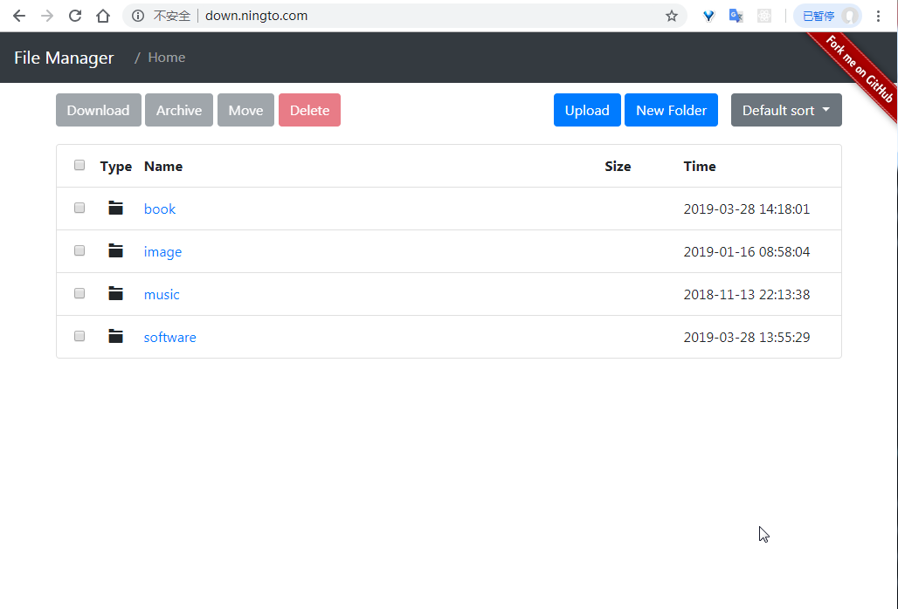

效果图：

# 文件管理
通过浏览器很方便的对远程文件进行管理

## Download 下载
点击文件可以直接下载，也可以勾选下载多个文件

## Delete 删除
可以同时删除多个文件和目录

## Move 移动
将文件，目录移动到其他目录或者更改名字

## Archive 打包
可以将多个文件或目录压缩成一个zip格式的文件进行下载

## Upload 上传
可以批量上传文件

## New Folder 新建目录
新建目录

## sort 排序
默认是升序，再次点击相同类型的排序或切换成逆序  
* Default Sort：不排序，显示的顺序就是文件所在服务器目录下的顺序  
* Type Sort：文件类型排序，文件或目录  
* Name Sort：根据名字排序  
* Size Sort：大小排序
* Time Sort：时间排序

> 单个文件上传大小限制为1G
